# Мультиклассовая семантическая сегментация кошек и собак

Проект выполнен в публичном fork
[`aspinozaxxx-lab/mmsegmentation`](https://github.com/aspinozaxxx-lab/mmsegmentation).
Fork создан от актуального на момент старта `main` upstream
[`open-mmlab/mmsegmentation`](https://github.com/open-mmlab/mmsegmentation);
исходный commit — `b040e147adfa027bbc071b624bedf0ae84dfc922`.
Каталог `practicum_work` является обычным каталогом внутри fork, а не Git
submodule.

Итог: выбранная строго по validation модель SegFormer MiT-B2 с TTA получила
**mDice(test) = 0.9216629060 (92.17% в mmseg-логе)** при требовании `> 0.75`.
Тестовая выборка была использована один раз после фиксации модели и режима
инференса.

| Итоговая test-метрика | Значение 0–1 | mmseg, % |
|---|---:|---:|
| mDice | **0.921663** | **92.17** |
| foreground mDice | 0.886935 | 88.69 |
| Dice background | 0.991118 | 99.11 |
| Dice cat | 0.908828 | 90.88 |
| Dice dog | 0.865043 | 86.50 |
| mIoU | 0.859155 | 85.92 |
| aAcc | 0.980799 | 98.08 |

Полные результаты находятся в
[`practicum_work/results`](practicum_work/results), а машиночитаемый реестр
конфигов, commit SHA, ClearML task ID и Share-ссылок — в
[`experiments.json`](practicum_work/results/experiments.json).

## Протокол экспериментов и воспроизводимость

- Классы зафиксированы как `0=background`, `1=cat`, `2=dog`,
  `255=ignore`.
- Все изображения и маски имеют размер `256×256`.
- Общий режим обучения: seed 42, deterministic mode, batch size 8, AMP,
  максимум 6000 итераций, Linear warm-up 200 итераций, PolyLR, validation
  каждые 250 итераций, сохранение лучшего `mDice`.
- Early stopping: восемь validation-проверок без улучшения минимум на
  0.1 процентного пункта.
- Checkpoint выбирался только по aggregate validation mDice. При разнице
  `<0.001` правило выбора использует foreground mDice, затем худший Dice
  foreground-класса. Test в ранжировании не участвует.
- Все метрики независимо пересчитаны из сохранённых label PNG: сначала
  суммируется confusion matrix по всей выборке, затем считаются aggregate
  Dice, class-wise Dice, foreground mDice, mIoU, accuracy и per-sample
  foreground Dice. Пиксели `255` исключаются.
- Значения в JSON хранятся в диапазоне 0–1. mmseg выводит округлённые
  проценты. Для финального test разница между независимым `0.9216629060` и
  mmseg `0.9217` равна `0.000037094 < 1e-4`.

Обучение выполнялось на RTX 5090 в отдельном Docker-контейнере без
`--privileged` и Docker socket, с лимитами 16 CPU, 48 GiB RAM и 8 GiB shared
memory. Системные Python/CUDA и существующие контейнеры сервера не
изменялись. Перед каждым запуском проверялась загрузка GPU.

Окружение описано в
[`Dockerfile`](practicum_work/environment/Dockerfile) и
[`versions.txt`](practicum_work/environment/versions.txt):

- `pytorch/pytorch:2.7.1-cuda12.8-cudnn9-devel`;
- PyTorch 2.7.1 + CUDA 12.8;
- `mmcv-lite==2.1.0`;
- `mmengine==0.10.7`;
- `clearml==2.1.10`.

Smoke-test подтвердил RTX 5090 compute capability `(12, 0)`, успешный импорт
mmseg/mmcv/mmengine, загрузку всех восьми конфигов, конечный
forward/backward без NaN и создание ClearML-задачи. Результат:
[`smoke_result.json`](practicum_work/results/smoke_result.json).

Задачи опубликованы в проекте ClearML
`Practicum/Sprint6-mmsegmentation` и имеют статус `Completed` + `Shared`.
Согласно механизму
[ClearML experiment sharing](https://clear.ml/docs/latest/docs/webapp/webapp_exp_sharing/),
Share-ссылка даёт зарегистрированному пользователю read-only доступ.
Hosted ClearML требует входа; полностью анонимный просмотр без учётной
записи платформа не предоставляет.

## Этап 1. Исследовательский анализ (EDA)

### Анализ качества данных

Исходный датасет содержал 200 train, 120 val и 120 test пар
«изображение–маска». Скрипт аудита проверил соответствие пар, размеры,
допустимые значения масок, количество компонент, площадь и bounding box
объектов, точные дубликаты, совпадение базовых COCO ID между split и
перцептивные dHash-дубликаты между split.

Обнаружены две группы дефектов:

1. Пять train-масок содержали только обрывки контура вместо размеченного
   объекта. Их удаление затрагивает лишь 5 из 200 исходных train-сэмплов
   (2.5%), поэтому ручная доразметка не требовалась:
   `000000028253_7169`, `000000574769_0`,
   `000000121530_5761`, `000000275919_4499`,
   `000000247301_4455`.
2. `000000481212_908` и `000000481212_908_1` — два идентичных изображения
   с дополняющими масками cat и dog. Они объединены в одну пару; 35 пикселей,
   где две маски конфликтуют, получили `ignore=255`.

После воспроизводимой чистки получены **194 train, 120 val и 120 test**
изображений. Val/test скопированы побайтово: общий SHA-256 manifest до и
после одинаков —
`e7ccda14e72d45c9abdf563b2e84d708661c41e2c702a490a4b5ddb73262280d`
для 480 файлов. Контракт чистки записан в
[`data_cleaning_manifest.json`](practicum_work/results/data_cleaning_manifest.json)
и проверяется автотестом.

Пример пяти удалённых дефектных масок:

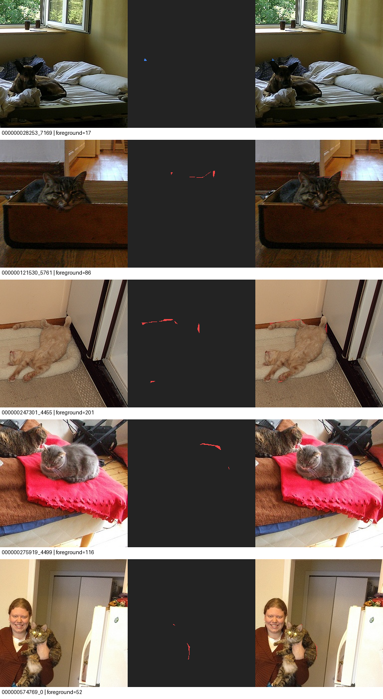

Объединение дубликата до/после (жёлтым обозначен `ignore=255`):

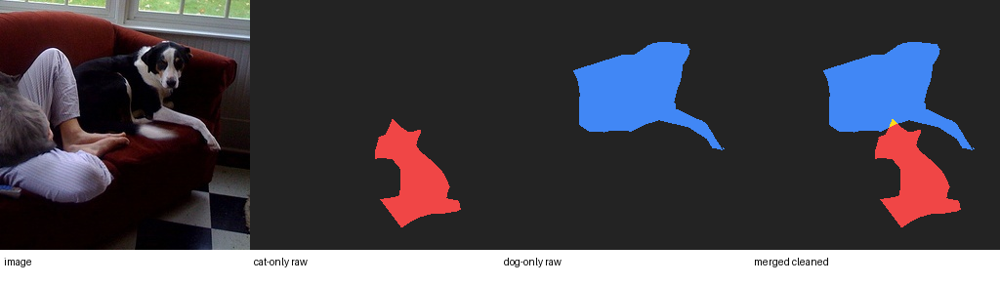

### EDA

Все 434 очищенных изображения имеют размер `256×256`. По всем split доли
валидных пикселей составляют:

| Класс | Доля пикселей | Присутствие в train |
|---|---:|---:|
| background | 89.9774% | 194 |
| cat | 5.7128% | 96 (95 cat-only + 1 cat/dog) |
| dog | 4.3098% | 99 (98 dog-only + 1 cat/dog) |

В train отдельно: background 90.5786%, cat 5.1343%, dog 4.2871%.
Следовательно, фон доминирует, а dog представлен слабее cat; одной общей
accuracy для оценки недостаточно.

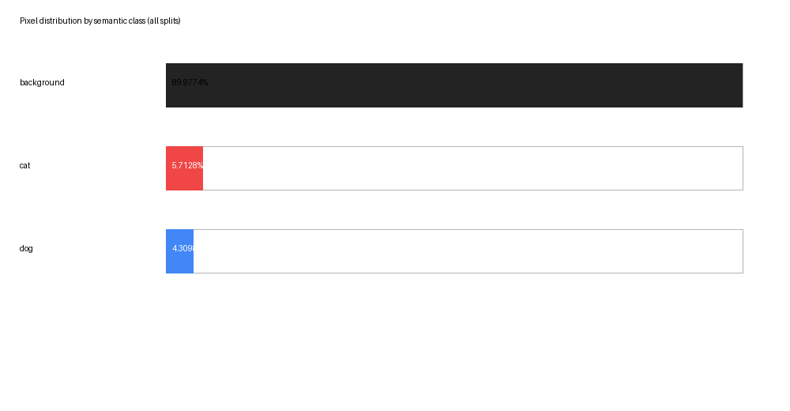

Доля foreground на изображение лежит в диапазоне `0.00508–0.35901`,
медиана `0.08880`. Число связных foreground-компонент:
минимум 1, медиана 1, максимум 17. Нормированный масштаб bounding box
`sqrt(area)/256`: минимум `0.08558`, медиана `0.42153`, максимум `0.70250`.

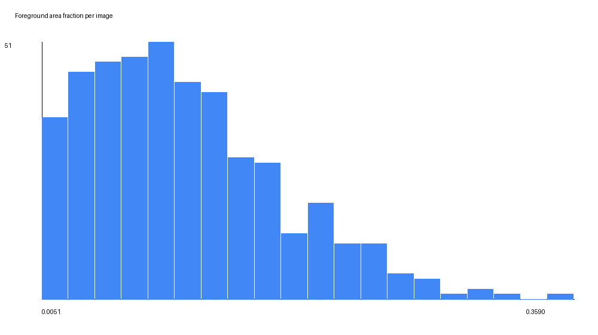

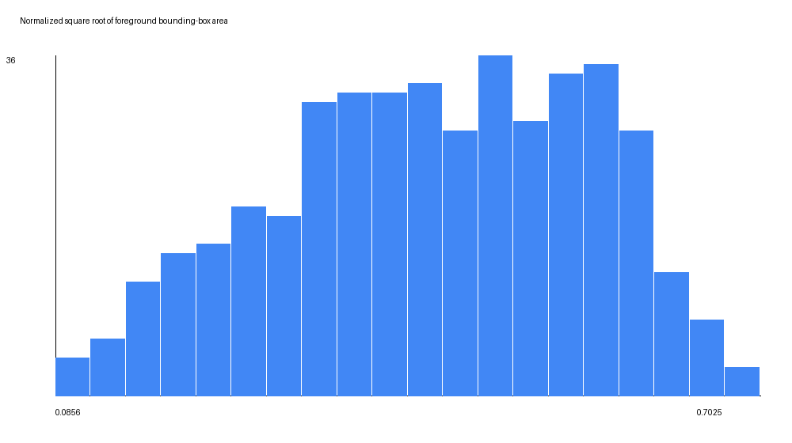

После чистки точных дубликатов не осталось. Пересечений базовых ID между
train/val/test и межсплитовых dHash-пар с расстоянием `≤5` не обнаружено,
то есть явной утечки данных нет. Val и test сбалансированы по присутствию:
по 60 изображений cat и dog в каждом.

Основные доменные трудности:

- кошка и собака могут иметь похожий силуэт, особенно при малом масштабе,
  размытии или окклюзии;
- фон занимает около 90% пикселей и может маскировать слабое качество
  foreground в общей метрике;
- поза, шерсть и размытая граница объекта дают неоднозначные контуры;
- отдельные изображения содержат очень маленький объект или много мелких
  компонент.

Полные исходные и очищенные таблицы находятся в
[`supplementary/viz/eda`](practicum_work/supplementary/viz/eda).

## Этап 2. Формирование первичных гипотез

### Стартовая гипотеза 1 — FCN ResNet-50-D8

**Описание гипотезы**

FCN с ImageNet-pretrained ResNet-50-D8 выбран как устойчивый CNN-бейзлайн.
Основная и auxiliary головы используют CrossEntropy; оптимизатор SGD
(`lr=0.01`, momentum `0.9`, weight decay `5e-4`). Минимальные аугментации:
resize `256×256` и horizontal flip. Это даёт понятную отправную точку без
сложного регуляризующего пайплайна.

**Результаты обучения**

- [Конфиг](practicum_work/configs/baseline_fcn_r50.py)
- [ClearML, task `9c5c881e6be1494ea39b28669d8f4b22`](https://app.clear.ml/projects/e46e637ae0f148c68f125b69cec89660/experiments/9c5c881e6be1494ea39b28669d8f4b22/output/execution)
- [Независимые validation-метрики](practicum_work/results/01_baseline_fcn_r50_val_metrics.json)
- Лучший checkpoint: iteration 5500

`mDice=0.897369`, foreground mDice `0.852807`; Dice:
background `0.986494`, cat `0.881841`, dog `0.823772`.

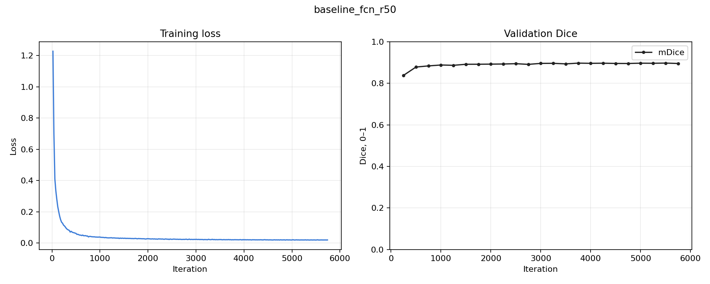

**Анализ качества**

FCN сразу превысил целевой уровень. При этом разрыв cat/dog равен 5.81
процентного пункта, поэтому фон не единственный источник высокого mDice.
Лучшие примеры имеют точный внешний контур; основные ошибки — пропуск
тонких частей, неточная граница и путаница классов на сложных ракурсах.

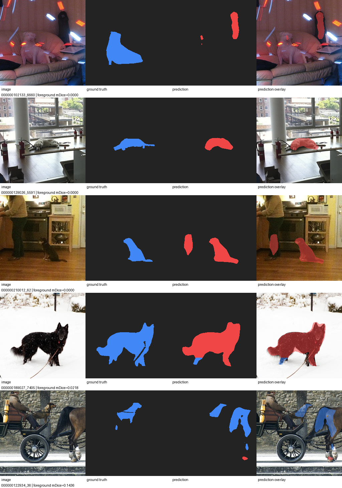

### Стартовая гипотеза 2 — SegFormer MiT-B0

**Описание гипотезы**

Компактный ImageNet-pretrained SegFormer MiT-B0 проверяет гипотезу, что
multi-scale transformer-признаки лучше обрабатывают разный размер объектов.
Использованы CrossEntropy, AdamW (`lr=6e-5`, weight decay `0.01`) и тот же
минимальный набор аугментаций, чтобы сравнение архитектур оставалось
интерпретируемым.

**Результаты обучения**

- [Конфиг](practicum_work/configs/baseline_segformer_mitb0.py)
- [ClearML, task `680a7ce5e4ca4a5da95f7bbc650984f9`](https://app.clear.ml/projects/e46e637ae0f148c68f125b69cec89660/experiments/680a7ce5e4ca4a5da95f7bbc650984f9/output/execution)
- [Независимые validation-метрики](practicum_work/results/02_baseline_segformer_mitb0_val_metrics.json)
- Лучший checkpoint: iteration 1750

`mDice=0.873697`, foreground mDice `0.818284`; Dice:
background `0.984523`, cat `0.852485`, dog `0.784083`.


**Анализ качества**

MiT-B0 уступил FCN на 2.3672 процентного пункта mDice и на 3.4522 пункта
foreground mDice. На маленьком train split компактный encoder и один CE
оказались недостаточны; сильнее всего страдает dog. Это определило
последовательность следующих экспериментов: сначала изменить loss, затем
регуляризацию, после этого ёмкость backbone.

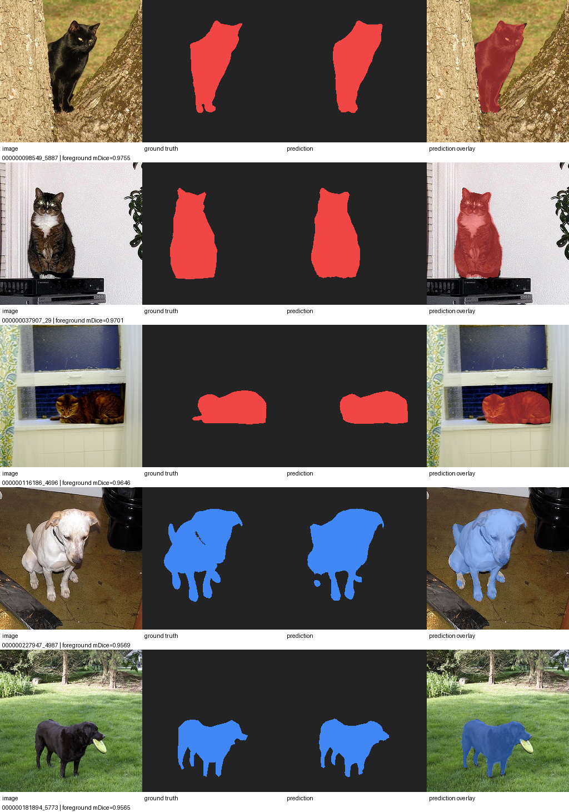

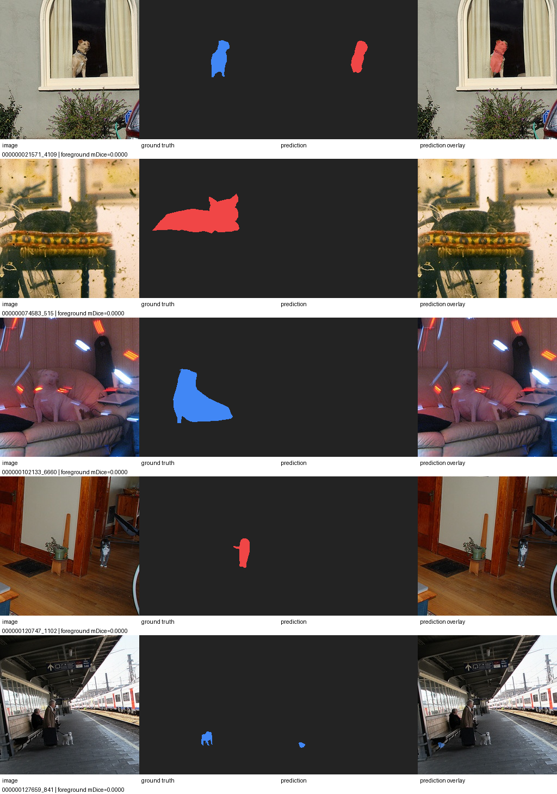

## Этап 3. Эксперименты по улучшению качества

### Эксперимент 1 — CrossEntropy + DiceLoss

**Описание эксперимента**

Архитектура, optimizer и аугментации MiT-B0 не менялись. К CrossEntropy
добавлен multiclass DiceLoss с `ignore_index=255`. Цель — напрямую
оптимизировать перекрытие и уменьшить влияние доминирующего фона.

**Результаты обучения**

- [Конфиг](practicum_work/configs/exp01_mitb0_ce_dice.py)
- [ClearML, task `1a9bd8d1ed7243e5a39e85f2394bd59b`](https://app.clear.ml/projects/e46e637ae0f148c68f125b69cec89660/experiments/1a9bd8d1ed7243e5a39e85f2394bd59b/output/execution)
- [Validation-метрики](practicum_work/results/03_exp_mitb0_ce_dice_val_metrics.json)
- Лучший checkpoint: iteration 3500

`mDice=0.876523`, foreground mDice `0.822186`; прирост к MiT-B0 CE:
`+0.2826` и `+0.3902` процентного пункта соответственно.

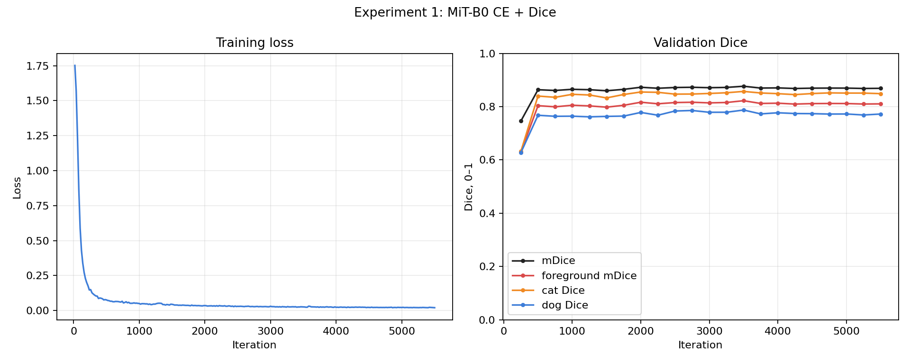

**Анализ качества**

Гипотеза подтвердилась умеренно: cat вырос до `0.857146`, dog до
`0.787226`. Loss улучшил перекрытие, но не решил нехватку разнообразия и
ошибки классификации похожих силуэтов.

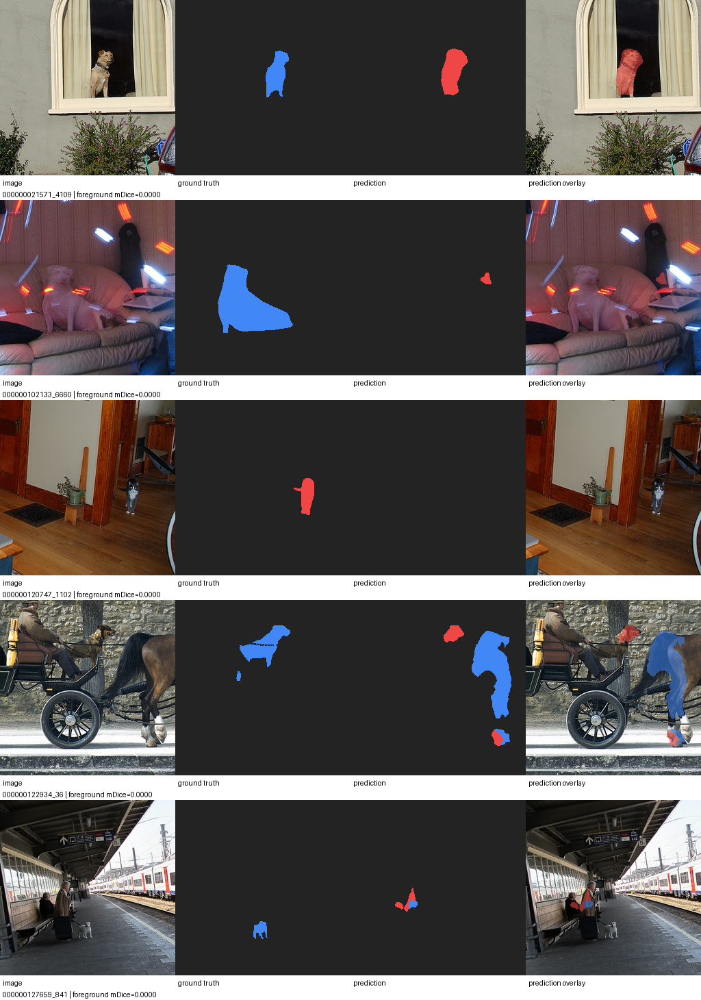

### Эксперимент 2 — усиленные аугментации

**Описание эксперимента**

К предыдущему варианту добавлены RandomResize с диапазоном `0.75–1.25`,
RandomCrop `256×256`, horizontal flip и PhotoMetricDistortion. Меняется
только train pipeline; модель, loss и optimizer сохранены. Цель —
стабилизировать модель на разном масштабе, освещении и кадрировании.

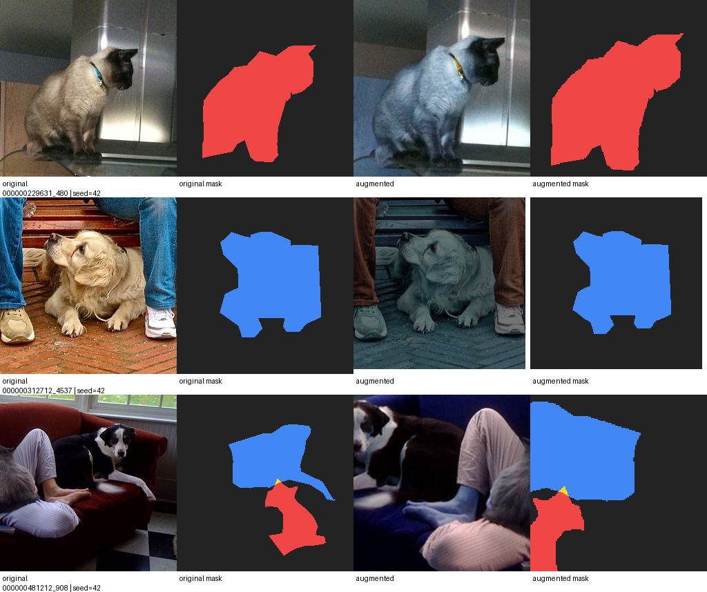

**Результаты обучения**

- [Конфиг](practicum_work/configs/exp02_mitb0_strong_aug.py)
- [ClearML, task `5ad50799efd44780a30b0bc68b1c1761`](https://app.clear.ml/projects/e46e637ae0f148c68f125b69cec89660/experiments/5ad50799efd44780a30b0bc68b1c1761/output/execution)
- [Validation-метрики](practicum_work/results/04_exp_mitb0_strong_aug_val_metrics.json)
- Лучший checkpoint: iteration 3250

`mDice=0.883640`, foreground mDice `0.832728`; прирост к эксперименту 1:
`+0.7118` и `+1.0542` процентного пункта.

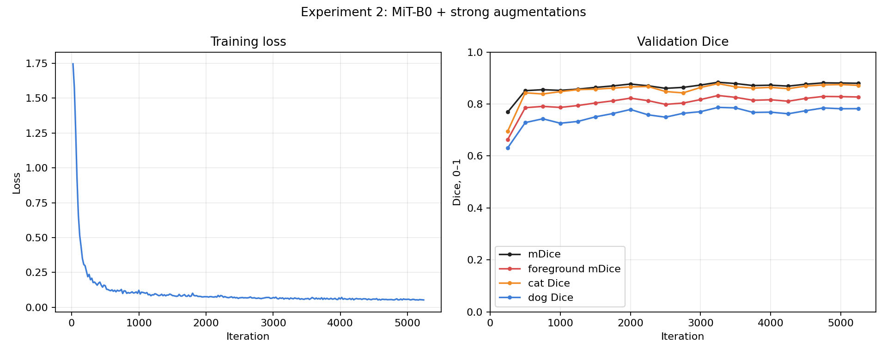

**Анализ качества**

Dice cat вырос до `0.878433`; dog практически не изменился (`0.787024`).
Аугментации улучшили устойчивость контура и cat, но dog остаётся узким
местом, что указывает на ограничение ёмкости признаков, а не только
переобучение.

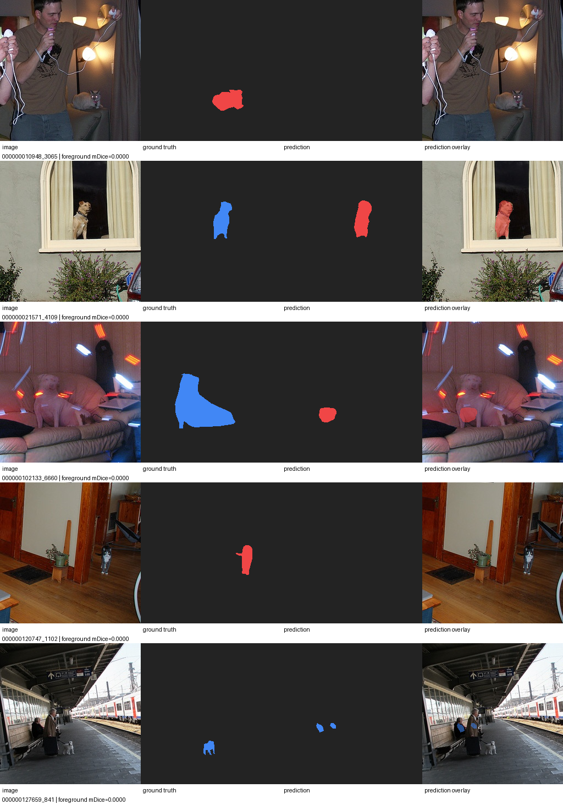

### Эксперимент 3 — MiT-B2

**Описание эксперимента**

MiT-B0 заменён на более ёмкий ImageNet-pretrained MiT-B2. Loss,
аугментации, AdamW и режим обучения оставлены прежними. Эксперимент
проверяет только влияние backbone.

**Результаты обучения**

- [Конфиг](practicum_work/configs/exp03_mitb2_strong_aug.py)
- [ClearML, task `5de076f4c4e74b7aab33dec7074ba33a`](https://app.clear.ml/projects/e46e637ae0f148c68f125b69cec89660/experiments/5de076f4c4e74b7aab33dec7074ba33a/output/execution)
- [Validation-метрики](practicum_work/results/05_exp_mitb2_strong_aug_val_metrics.json)
- Лучший checkpoint: iteration 3750

`mDice=0.932778`, foreground mDice `0.904222`; прирост к эксперименту 2:
`+4.9137` и `+7.1493` процентного пункта. Dice cat `0.921465`, dog
`0.886978`.

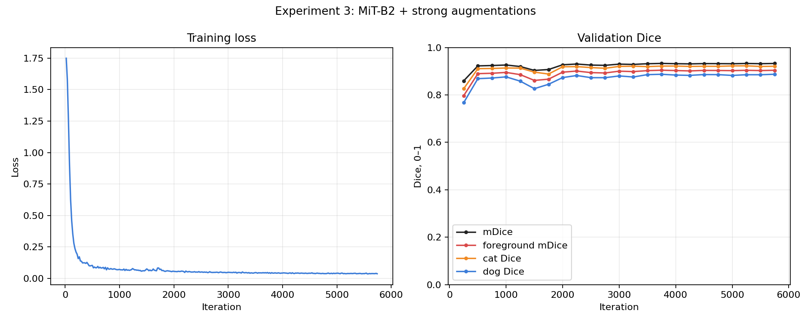

**Анализ качества**

Это самое крупное улучшение серии. Более ёмкие multi-scale признаки
существенно снизили ошибки dog и улучшили границы. Условие плана для TTA
выполнено с запасом: validation mDice `0.9328 ≥ 0.78`, Dice cat и dog выше
`0.70`.

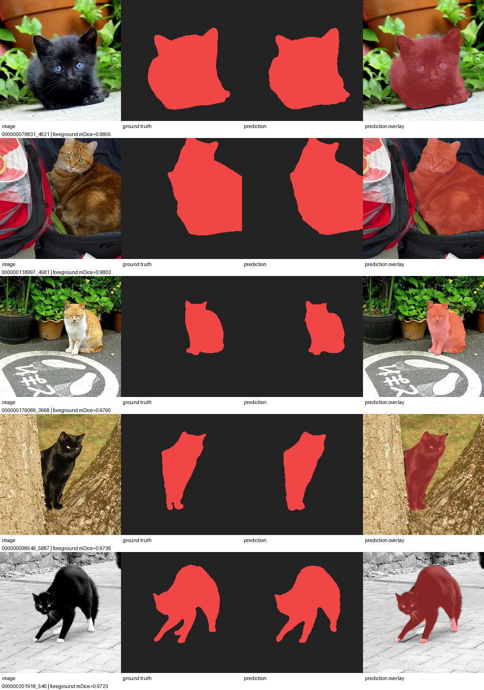

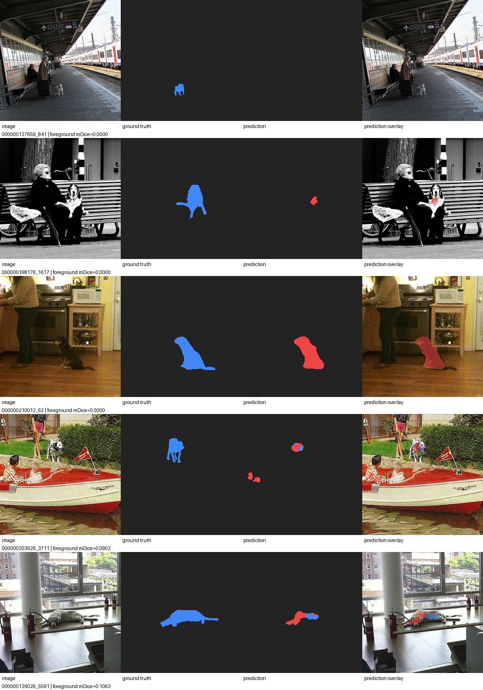

### Эксперимент 4 — TTA

**Описание эксперимента**

Для checkpoint эксперимента 3 применены масштабы `192×192`, `256×256`,
`320×320` и horizontal flip. Логиты шести представлений агрегируются
`SegTTAModel`. Обучение не выполняется, поэтому отдельной train-кривой у
этого эксперимента нет. Fallback-конфиг продолжения MiT-B2 на 3000
итераций с `lr=2e-5` сохранён в
[`exp04_mitb2_long_finetune.py`](practicum_work/configs/exp04_mitb2_long_finetune.py),
но по условию плана не запускался.

**Результаты обучения/оценки**

- [TTA-конфиг](practicum_work/configs/exp04_mitb2_tta.py)
- [ClearML, task `3be5d8852d0649ed8d6b26a0861019be`](https://app.clear.ml/projects/e46e637ae0f148c68f125b69cec89660/experiments/3be5d8852d0649ed8d6b26a0861019be/output/execution)
- [Validation-метрики](practicum_work/results/06_exp_mitb2_tta_val_metrics.json)

`mDice=0.936533`, foreground mDice `0.909469`; прирост к MiT-B2 без TTA:
`+0.3756` и `+0.5247` процентного пункта. Dice background `0.990662`,
cat `0.927471`, dog `0.891466`.

**Анализ качества**

TTA даёт небольшой, но согласованный прирост обоим foreground-классам и
выигрывает больше установленного tie-порога `0.001`; дополнительные
tie-break правила не понадобились. Этот режим выбран для единственного
финального запуска на test.

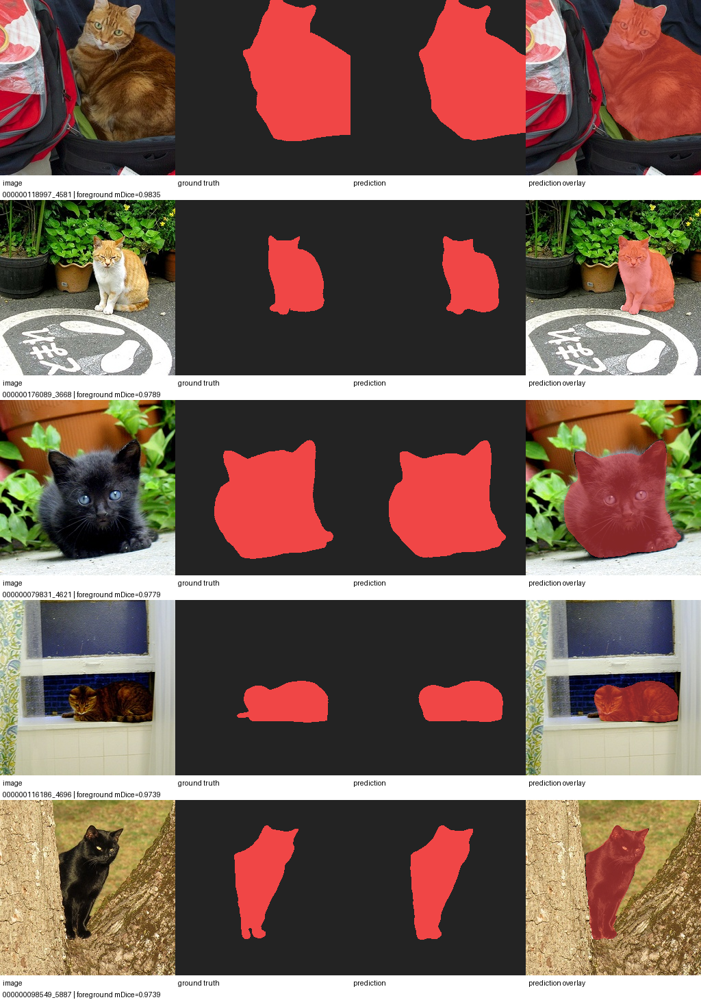

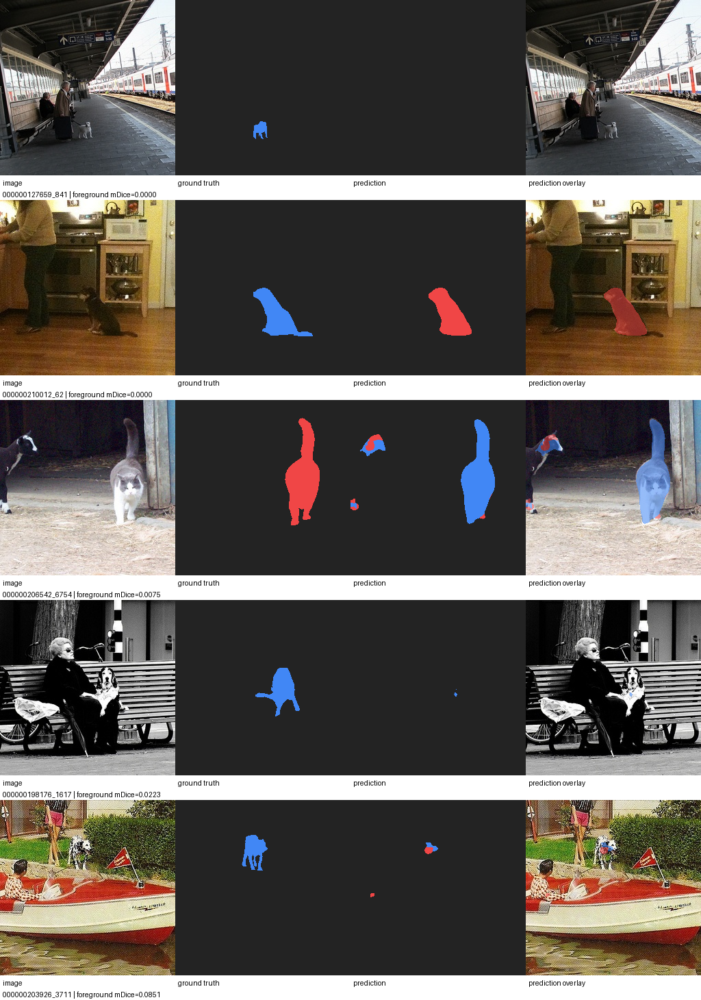

### Сводное сравнение на validation

| Ранг | Вариант | mDice | FG mDice | Dice bg | Dice cat | Dice dog |
|---:|---|---:|---:|---:|---:|---:|
| 1 | MiT-B2 + TTA | **0.936533** | **0.909469** | 0.990662 | **0.927471** | **0.891466** |
| 2 | MiT-B2, strong aug | 0.932778 | 0.904222 | 0.989890 | 0.921465 | 0.886978 |
| 3 | FCN-R50 | 0.897369 | 0.852807 | 0.986494 | 0.881841 | 0.823772 |
| 4 | MiT-B0, strong aug | 0.883640 | 0.832728 | 0.985465 | 0.878433 | 0.787024 |
| 5 | MiT-B0, CE+Dice | 0.876523 | 0.822186 | 0.985196 | 0.857146 | 0.787226 |
| 6 | MiT-B0, CE | 0.873697 | 0.818284 | 0.984523 | 0.852485 | 0.784083 |

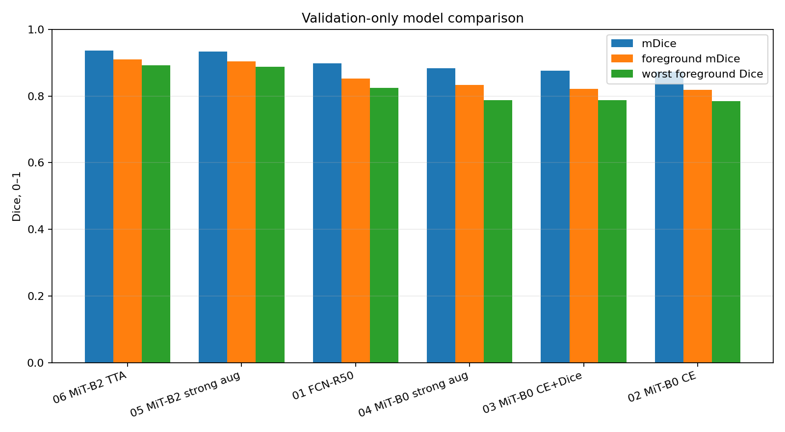

Правило и порядок выбора воспроизводятся скриптом
[`compare_experiments.py`](practicum_work/src/analysis/compare_experiments.py);
исходные [CSV](practicum_work/results/comparison/validation_experiments.csv)
и [JSON](practicum_work/results/comparison/validation_selection.json)
зафиксированы в репозитории.

## Этап 4. Заключение и выбор лучшего эксперимента

### Лучший эксперимент

Выбран SegFormer MiT-B2, обученный с CrossEntropy + DiceLoss и сильными
аугментациями, с TTA на масштабах 192/256/320 и horizontal flip. Выбор
сделан исключительно по validation: `0.936533` против `0.932778` у той же
модели без TTA.

- [Финальный конфиг](practicum_work/configs/final_test_mitb2.py)
- [Лучший validation ClearML](https://app.clear.ml/projects/e46e637ae0f148c68f125b69cec89660/experiments/3be5d8852d0649ed8d6b26a0861019be/output/execution)
- [Финальный test ClearML, task `f6f3773d25bf40248e73b450f8472609`](https://app.clear.ml/projects/e46e637ae0f148c68f125b69cec89660/experiments/f6f3773d25bf40248e73b450f8472609/output/execution)
- [Полные независимые test-метрики](practicum_work/results/07_final_test_selected_model_test_metrics.json)

**mDice (test subset) = 0.9216629060 (92.17%)**

Confusion matrix (`строка = ground truth`, `столбец = prediction`):

| GT \ Pred | background | cat | dog |
|---|---:|---:|---:|
| background | 7,002,399 | 16,275 | 37,545 |
| cat | 39,870 | 406,913 | 9,894 |
| dog | 31,815 | 15,603 | 304,006 |

Лучший checkpoint: `best_mDice_iter_3750.pth`, 99,624,743 bytes,
SHA-256
`cda54ffd5a67a465bd1fa88368046cc4087a06efeea53cf29346fed7149b7bd8`.
Он возвращён локально в
`practicum_work/results/checkpoints/best_mDice_iter_3750.pth`, но согласно
условиям не включён в Git/ZIP. В ClearML checkpoint загружен восемью
проверяемыми частями; manifest находится в
[`best_checkpoint_manifest.json`](practicum_work/results/best_checkpoint_manifest.json).
После скачивания частей восстановление с обязательной проверкой каждого
хеша выполняется так:

```bash
python practicum_work/src/analysis/checkpoint_chunks.py join \
  checkpoint_chunks_manifest.json \
  --output best_mDice_iter_3750.pth
```

### Примеры корректных предсказаний (тестовый датасет)

Каждая панель слева направо показывает image, ground truth, prediction и
prediction overlay. Cat обозначен красным, dog синим. Пять лучших примеров
по per-sample foreground Dice:

| Пример | Визуализация |
|---|---|
| `000000543836_507`, Dice 0.9821 | 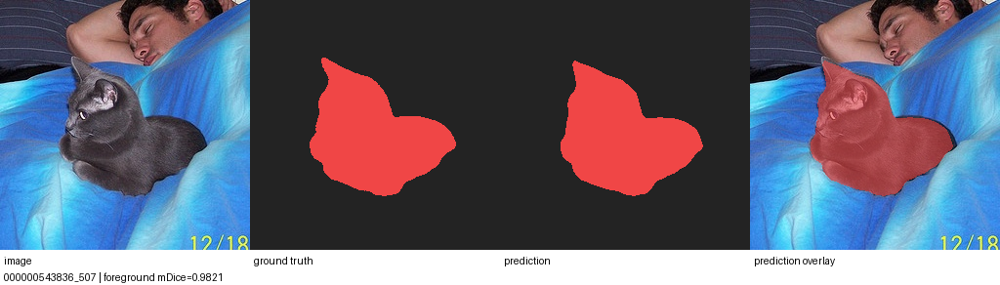 |
| `000000406211_2388`, Dice 0.9791 | 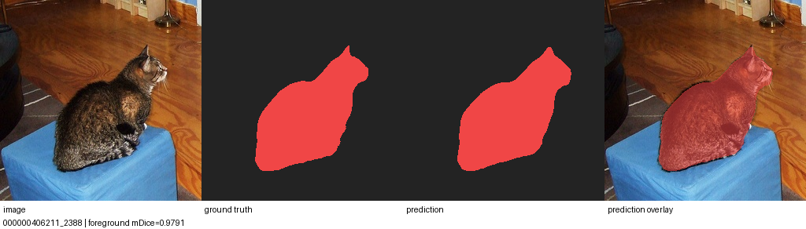 |
| `000000437537_2563`, Dice 0.9739 | 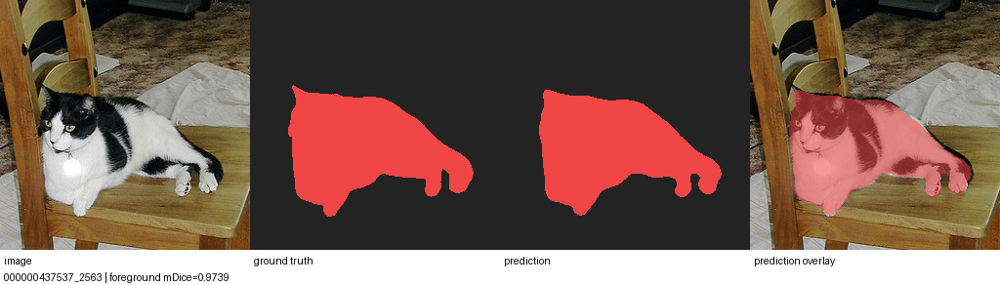 |
| `000000364167_7048`, Dice 0.9736 | 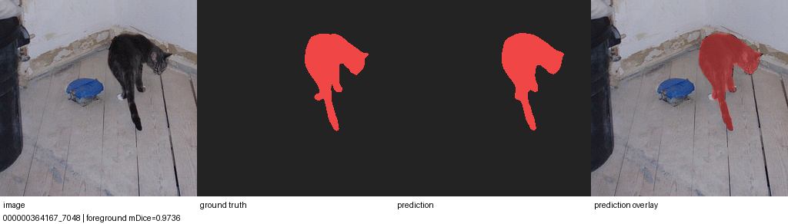 |
| `000000284148_7566`, Dice 0.9731 | 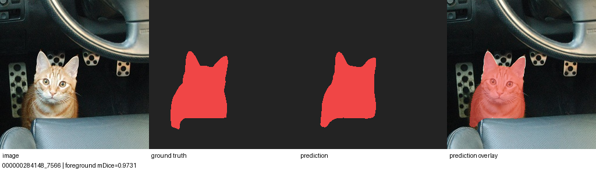 |

### Примеры ошибок (тестовый датасет)

Пять худших примеров по той же заранее заданной метрике:

| Пример | Визуализация |
|---|---|
| `000000284884_6459`, Dice 0.0000 | 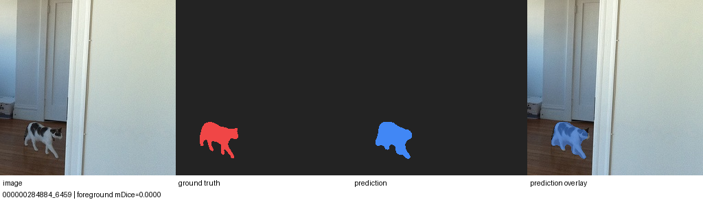 |
| `000000369547_1504`, Dice 0.0000 | 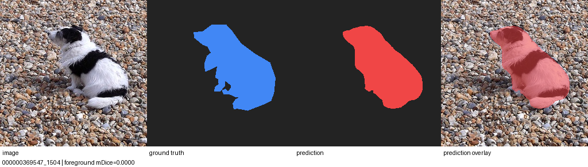 |
| `000000436539_4321`, Dice 0.0000 | 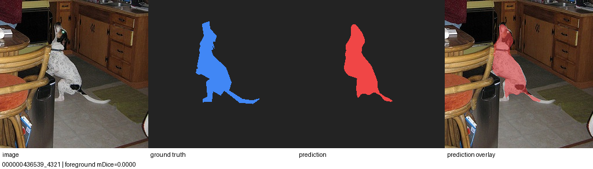 |
| `000000445187_3686`, Dice 0.0000 | 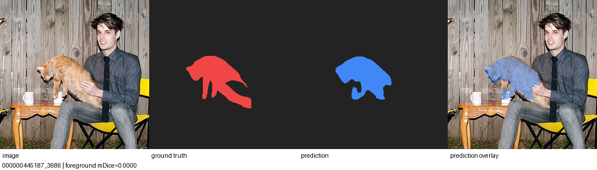 |
| `000000476276_4024`, Dice 0.0000 | 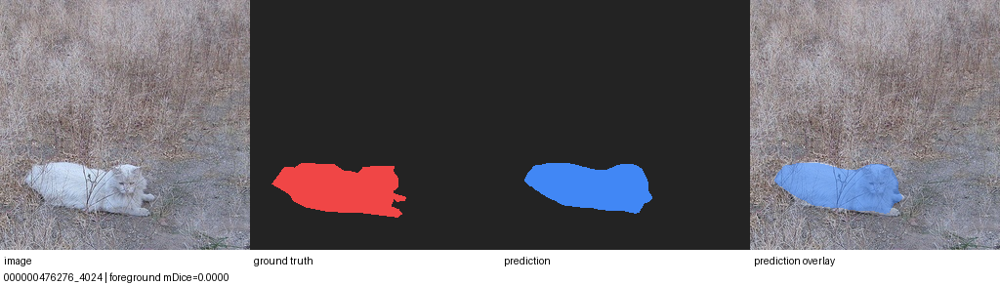 |

Во всех пяти худших случаях модель в основном локализует правильный силуэт,
но меняет семантический класс cat ↔ dog, поэтому foreground Dice нужного
класса равен нулю. Ошибки усиливаются при неоднозначном ракурсе, частичной
окклюзии, слабом контрасте или малом количестве породоспецифичных деталей.
Это именно ошибка распознавания класса, а не только сегментации границы.

### Возможности для улучшения

1. Добавить class-balanced sampling и больше сложных примеров пород/ракурсов,
   на которых cat и dog визуально похожи; предварительно провести повторный
   аудит их разметки.
2. Проверить auxiliary classification/contrastive objective на глобальных
   признаках изображения, чтобы отделить ошибку класса от ошибки контура.
3. Проверить более крупный encoder или ансамбль нескольких seed, выбирая
   решение только по validation foreground и worst-class Dice.
4. Настроить crop/scale policy на маленькие объекты и добавить
   object-aware crops, не используя test для подбора.

## Этап 5. Документация кода

```text
practicum_work
├── configs
│   ├── _base_
│   │   ├── dataset.py                — датасет, классы, dataloader и TTA
│   │   └── runtime.py                — seed, scheduler, hooks и early stopping
│   ├── baseline_fcn_r50.py           — стартовая гипотеза FCN-R50
│   ├── baseline_segformer_mitb0.py   — стартовая гипотеза MiT-B0
│   ├── exp01_mitb0_ce_dice.py        — CE + DiceLoss
│   ├── exp02_mitb0_strong_aug.py     — усиленные аугментации
│   ├── exp03_mitb2_strong_aug.py     — MiT-B2
│   ├── exp04_mitb2_tta.py            — выбранная ветка TTA
│   ├── exp04_mitb2_long_finetune.py  — не запущенная fallback-ветка
│   └── final_test_mitb2.py           — финальный one-shot test
├── environment
│   ├── Dockerfile                    — изолированное CUDA-окружение
│   └── versions.txt                  — зафиксированные версии
├── src
│   ├── data
│   │   ├── audit_dataset.py          — аудит, EDA, утечки и PNG/CSV/JSON
│   │   ├── clean_dataset.py          — удаление 5 пар и слияние дубликата
│   │   └── visualize_augmentations.py— визуализация train pipeline
│   ├── analysis
│   │   ├── run_evaluation.py         — mmseg val/test и выгрузка PNG
│   │   ├── evaluate_predictions.py   — независимые Dice/IoU/confusion
│   │   ├── render_predictions.py     — лучшие/худшие панели
│   │   ├── plot_training_curves.py   — кривые из mmengine scalars
│   │   ├── compare_experiments.py    — validation-only ранжирование
│   │   ├── publish_clearml_results.py— метрики и provenance в ClearML
│   │   └── checkpoint_chunks.py      — split/join с SHA-256-проверкой
│   └── smoke_test.py                 — CUDA/import/config/backward/ClearML
├── supplementary
│   └── viz                          — EDA, аугментации, кривые, prediction
├── results
│   ├── comparison                   — итоговое validation-ранжирование
│   ├── *_metrics.json               — независимые метрики запусков
│   ├── experiments.json             — task ID, URL, config и git SHA
│   └── best_checkpoint_manifest.json
└── tests
    └── test_data_pipeline.py         — чистка, метрики и tie-break
```

### Основные команды

Очистка и повторный EDA:

```bash
python -m practicum_work.src.data.clean_dataset
python -m practicum_work.src.data.audit_dataset
python -m unittest practicum_work.tests.test_data_pipeline -v
```

Сборка окружения:

```bash
docker build \
  -f practicum_work/environment/Dockerfile \
  -t sprint6-mmseg:0c62744 .
```

Пример безопасного запуска контейнера на сервере:

```bash
docker run --rm --gpus '"device=0"' \
  --cpus 16 --memory 48g --shm-size 8g \
  --env-file /opt/prak/project6/.secrets/clearml.env \
  -v /opt/prak/project6/repo:/workspace/repo \
  -w /workspace/repo \
  sprint6-mmseg:0c62744 \
  python tools/train.py practicum_work/configs/exp03_mitb2_strong_aug.py
```

Test-команда не является частью перебора: она запускается только для
зафиксированного validation-победителя через
[`run_evaluation.py`](practicum_work/src/analysis/run_evaluation.py) с
`--split test --tta`.

### Что не входит в репозиторий

В Git и итоговый архив намеренно не включены исходный/очищенный dataset,
Docker layers, Python-окружения, ClearML credentials, raw PNG-предсказания,
логи, промежуточные checkpoints и полный `.pth`. Код, resolved-наследование
конфигов, итоговые JSON/CSV, графики и report-панели находятся в
репозитории. Временные ClearML credentials после публикации отозваны.
